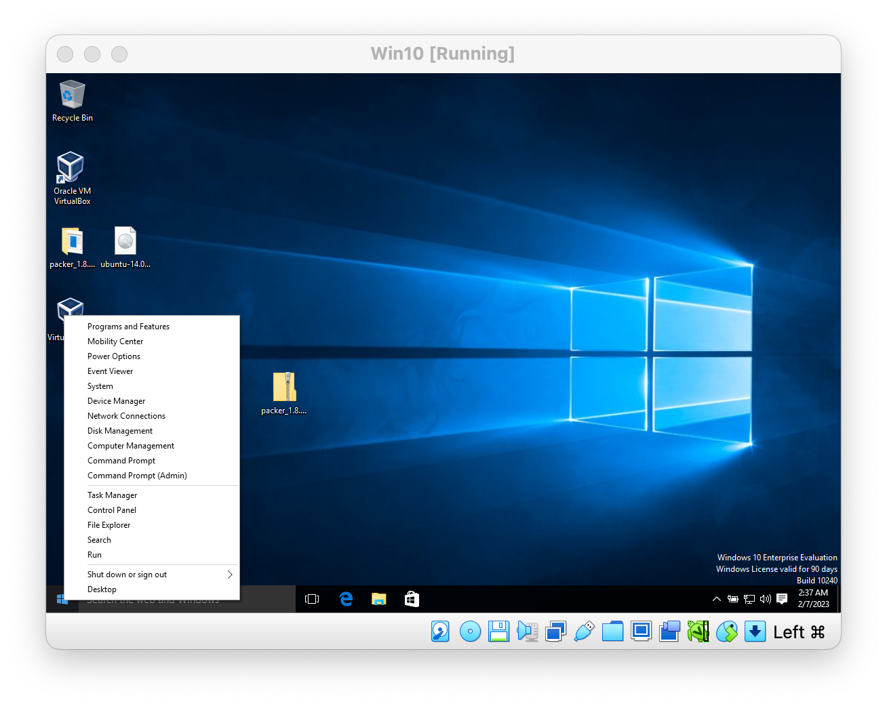
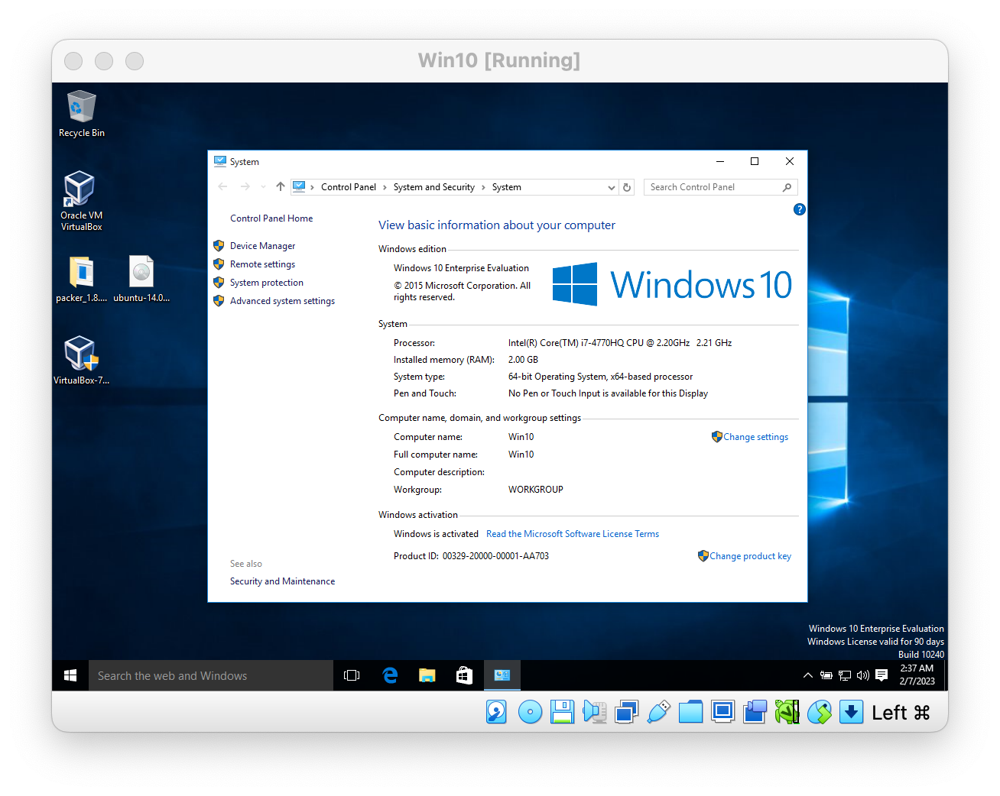
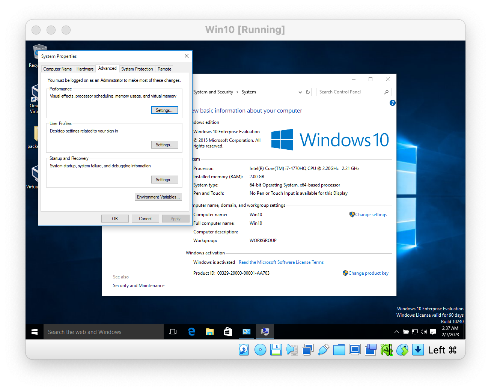
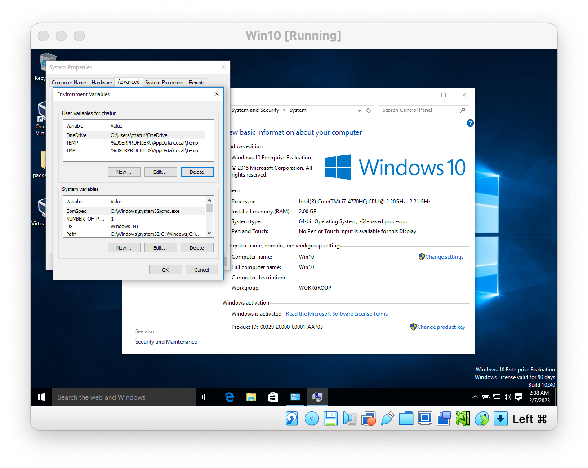
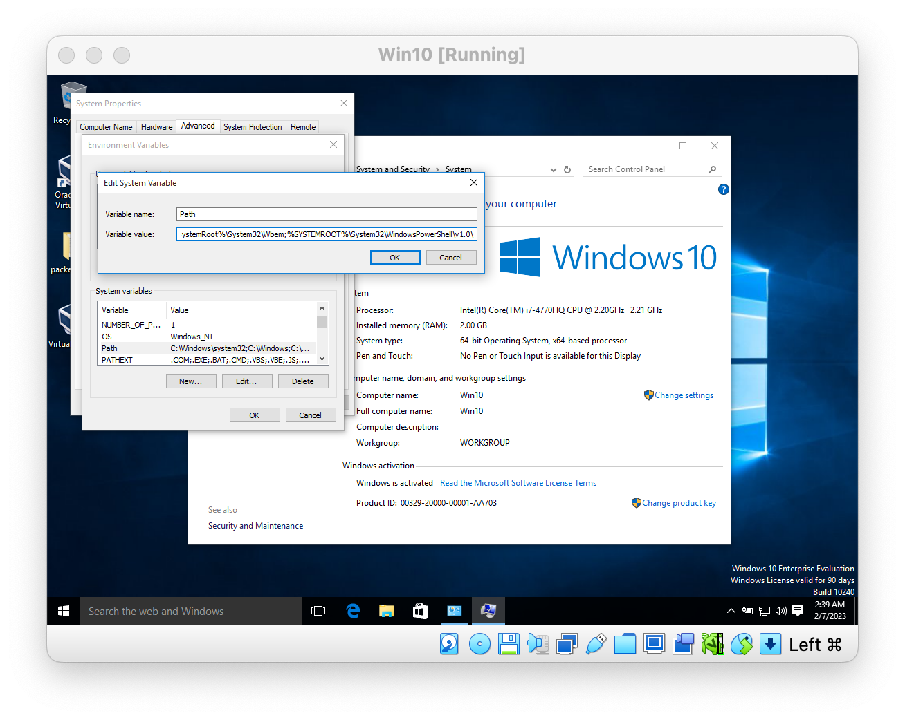
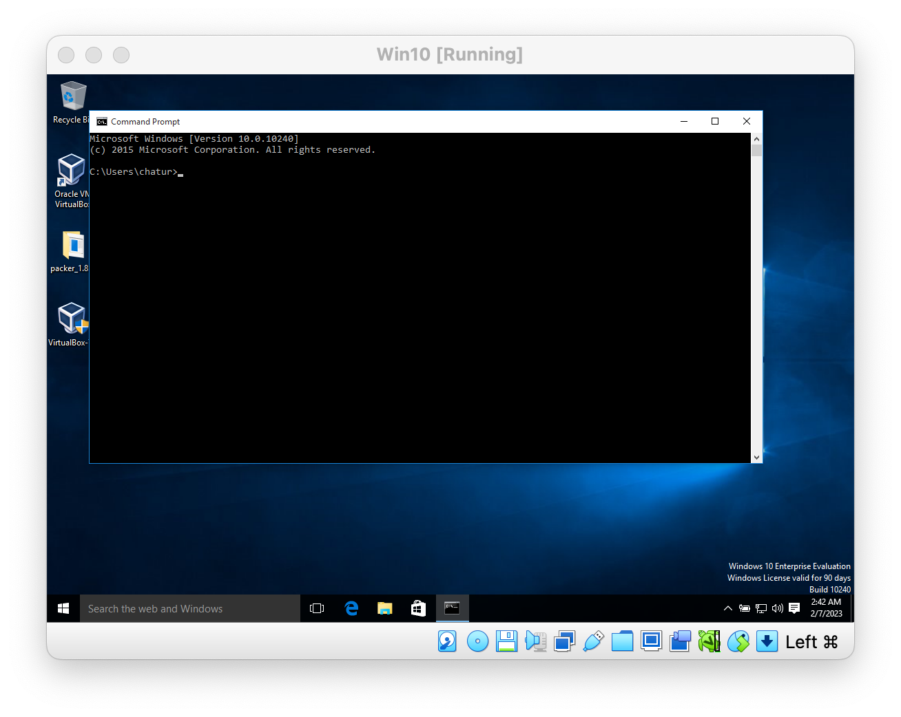
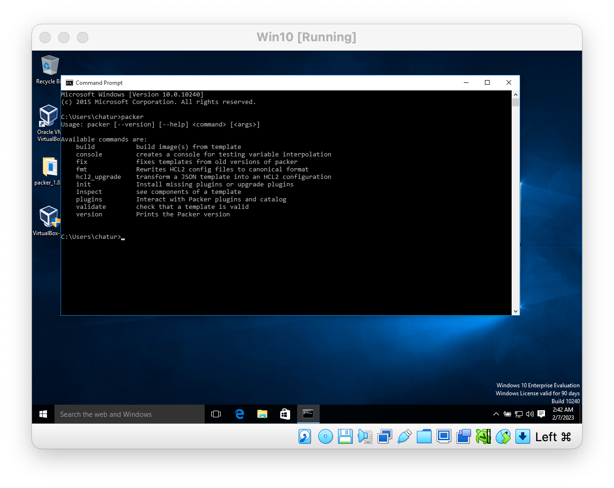

# Packer lab

## Install Packer

Separate instructions follow for Mac OSX/Linux and Windows.

### Mac OSX/Linux

1. Download the appropriate precompiled binary package for your system form [https://developer.hashicorp.com/packer/downloads](https://developer.hashicorp.com/packer/downloads)

2. After downloading Packer, unzip the package. Packer runs as a single binary named `packer`.

3. Move the Packer binary to `/usr/local/bin/`

~~~bash
$ mv ~/Downloads/packer /usr/local/bin/
~~~

### Windows

1. Download the appropriate precompiled binary package for your system form [https://developer.hashicorp.com/packer/downloads](https://developer.hashicorp.com/packer/downloads)

2. After downloading Packer, unzip the package. Packer runs as a single binary named `packer`.

3. Rename folder `packer` from `packer_1.8.5_windows_amd64`

4. Move `packer` folder to C: drive

5. Finally, make sure that the `packer` binary is available on your `PATH`. This process will differ depending on your operating system.

   Please follow [This Stack Overflow article](https://stackoverflow.com/questions/1618280/where-can-i-set-path-to-make-exe-on-windows) contains instructions for setting the `PATH` on Windows through the user interface.

   or

   - right click on windows logo
     

   - then click on System
     
   - then click Advanced system settings
     
   - then click Environment Variables
     
   - select `Path` from System variables then click Edit...
     
   - on Variable Value, add following at the end

     ~~~txt
     ;C:\packer;
     ~~~

     

   - click ok to apply
   - again click ok to apply
   - again click ok to exit

6. Verify packer install
   - open Command prompt
     
   - type `packer` and you should see output similar below
     
