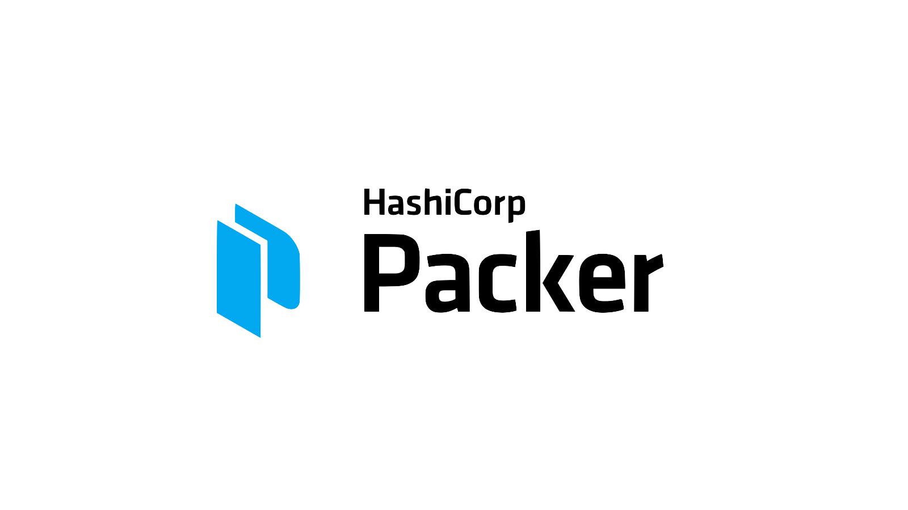
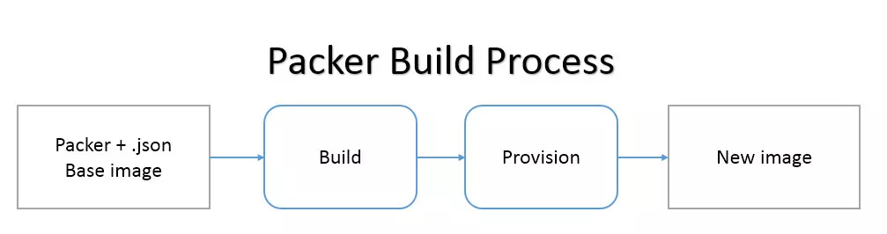
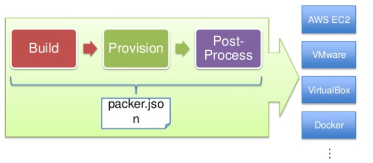
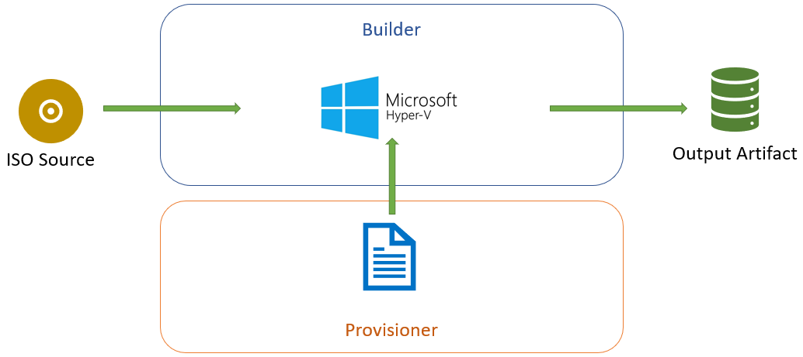

<!--
_class: lead
_footer: '' 
_paginate: false
-->

# Introduction

to

&nbsp;
&nbsp;
&nbsp;
&nbsp;

### NREN

Feb 10 - 12, 2023

~~~licence
This material is licensed under a Creative Commons Attribution-NonCommercial 4.0 International License (http://creativecommons.org/licenses/by-nc/4.0/)
~~~

---

## Introduction

Packer is an open source tool for creating identical machine images for multiple platforms from a single source configuration.

- It is lightweight runs on every major operating system, and is highly performant, creating machine images for multiple platforms in parallel.
- It does not replace configuration management like Ansible, Chef or Puppet.
- In fact, when building images, it is able to use tools like Ansible, Chef or Puppet to install software onto the image.
- It only builds images. It does not attempt to manage them in any way. After they're built, it is up to you to launch or destroy them.

---

## What is _Machine Image_?

A _**machine image**_ is a single static unit that contains a pre-configured operating system and installed software which is used to quickly create new running machines.

- Machine image formats change for each platform.
- Some examples include
  - OVF exports for VirtualBox
  - VMDK/VMX files for VMware
  - AMIs for Amazon EC2, etc.

---

## Why Use Packer?

Pre-baked machine images have a lot of advantages, but most have been unable to benefit from them because images have been too tedious to create and manage.

- It automates the creation of any type of machine image.
- It embraces modern configuration management by encouraging you to use a framework such as Ansible, Chef or Puppet to install and configure the software within your Packer-made images.

---

## Advantages of Using Packer

- Super fast infrastructure deployment.
  - Packer images allow you to launch completely provisioned and configured machines in seconds, rather than several minutes or hours.
  - This benefits not only production, but development as well, since development virtual machines can also be launched in seconds, without waiting for a typically much longer provisioning time.

- Multi-provider portability.
  - Because Packer creates identical images for multiple platforms, you can run production in AWS, staging/QA in a private cloud like OpenStack, and development in desktop virtualization solutions such as VMware or VirtualBox.
  - Each environment is running an identical machine image, giving ultimate portability.

- Improved stability.
  - Packer installs and configures all the software for a machine at the time the image is built.
  - If there are bugs in these scripts, they'll be caught early, rather than several minutes after a machine is launched.

- Greater testability.
  - After a machine image is built, that machine image can be quickly launched and smoke tested to verify that things appear to be working.
  - If they are, you can be confident that any other machines launched from that image will function properly.

---

## Use Cases 1

- Continuous Delivery
  - Packer is lightweight, portable, and command-line driven. This makes it the perfect tool to put in the middle of your continuous delivery pipeline. Packer can be used to generate new machine images for multiple platforms on every change to Chef/Puppet.
  - As part of this pipeline, the newly created images can then be launched and tested, verifying the infrastructure changes work. If the tests pass, you can be confident that the image will work when deployed. This brings a new level of stability and testability to infrastructure changes.

---

## Use Cases 2

- Dev/Prod Parity
  - Packer helps keep development, staging, and production as similar as possible. Packer can be used to generate images for multiple platforms at the same time. So if you use AWS for production and VMware (perhaps with Vagrant) for development, you can generate both an AMI and a VMware machine using Packer at the same time from the same template.
  - Mix this in with the continuous delivery use case above, and you have a pretty slick system for consistent work environments from development all the way through to production.

---

## Use Cases 3

- Appliance/Demo Creation
  - Since Packer creates consistent images for multiple platforms in parallel, it is perfect for creating appliances and disposable product demos. As your software changes, you can automatically create appliances with the software pre-installed. Potential users can then get started with your software by deploying it to the environment of their choice.

---

## Supported Platforms

- VirtualBox (OVF)
- VMware (VMX)
- Docker
- Parallels
- QEMU
- Amazon EC2 (AMI)
- CloudStack
- OpenStack
- DigitalOcean
- Google Compute Engine

> You can add support to any platform by extending Packer by using plugins.

---

## Installing Packer

- Using precompiled binaries
- Compiling, installing from sources
- Alternatice installation methods like
  - Chocolatery
  - Homebrew

---

## Packer Commands (CLI)

All interaction with Pcaker is done via the _**packer**_ tool.
Available Packer commands:

- build
- fix
- inspect
- push
- validate

---

## Packer Templates

The JSON configuration files used to define/describe images.
Templates are divided into:

- builders (_required_)
- provisioners (_optional_)
- post-processors (_optional_)
- variables (_optional_)

---

## Builders

Builders are responsivle for creating machines and generating images for various platforms.

Popular supported builders by Packer:

- VirtualBox
- VMware
- Docker
- Azure/Hyper-V
- Amazon EC2 (AMI)
- DigitalOcean
- Google Cloud

---

## Provisioners

Provisioners are responsible for preparing and configuring the operating system.

Popular supported provisoners by Packer:

- Shell
- PowerShell
- Ansible
- Puppet
- Chef
- Salt

---

## Workflow

---

## Workflow

---

## Workflow

---

## Workflow Terminology

- Templates
  - JSON file containing the build information
- Builders
  - Platform specific building configuration
- Procisioners:
  - Tools that install software after the initial OS install
- Post-processors
  - Actions to happen after the image has been built

---

## Workflow - Builders sample code <!--fit-->

~~~JSON
{
  "builders": [
    {
      "boot_command": [
      "ainy<wait10><wait10><wait10><enter>",
      "<wait10><wait10><wait10><wait10><wait10>",
      "<wait10><wait10><wait10><wait10>",
      "admin<enter><wait>",
      "<enter><wait>",
      "<enter><wait5>",
      "Y<wait5>",
      "q<wait5>",
      "<enter><wait5>",
      "/ip dhcp-client add disabled=no interface=ether1<enter><wait5>"
      ],
      "boot_wait": "15s",
      "communicator": "ssh",
      "guest_os_type": "Linux",
      "iso_url": "https://download2.mikrotik.com/routeros/{{ user `ros_version` }}/mikrotik-{{ user `ros_version` }}.iso",
      "ssh_username": "{{ user `ssh_username` }}",
      "ssh_password": "{{ user `ssh_password` }}",
      "type": "virtualbox-iso",
      "vboxmanage": [
        ["modifyvm", "{{.Name}}", "--memory", "128"],
        ["modifyvm", "{{.Name}}", "--cpus", "1"],
        ["modifyvm", "{{.Name}}", "--nic1", "nat"],
        ["modifyvm", "{{.Name}}", "--nic2", "hostonly", "--hostonlyadapter2", "vboxnet0"],
      ],
      "virtualbox_version_file": "",
      "vm_name": "mikrotik-{{ user `ros_version` }}"
    }
  ]
}
~~~

---

## Workflow - Provisioners sample code <!--fit-->

~~~~json
  "provisioners": [
    {
        "type": "shell",
        "script": "scripts/defconf.rsc",
        "execute_command": "/import verbose=yes {{ .Path }}",
        "remote_path": "defconf.rsc",
        "skip_clean": true
    }
  ],

~~~~

---

## Workflow - Post processor sample code <!--fit-->

~~~~json
  "post-processors": [
    [
      {
        "type": "vagrant",
        "keep_input_artifact": false,
        "output": "./box/mikrotik-routeros-{{ user `ros_version` }}.box",
        "vagrantfile_template": "Vagrantfile.template"
      },
      {
        "type": "vagrant-cloud",
        "box_tag": "chatur/mikrotik-beta",
        "access_token": "{{user `cloud_token`}}",
        "version": "{{user `ros_version`}}"
      }
    ]
  ],
~~~~

---

## Workflow - Variables sample code <!--fit-->

~~~~json
  "variables": {
    "cloud_token": "XL8PkVdlkPHoo1T3RqD6",
    "disk_size": "128",
    "headless": "true",
    "hostonly": "vboxnet0",
    "intnet": "intnet",
    "iso_checksum_type": "md5",
    "shutdown_command": "/system shutdown",
    "ssh_password": "",
    "ssh_timeout": "5m",
    "ssh_username": "admin",
    "version": "{{ user `ros_version` }}"
  }
~~~~

---

## More info and documentation

- Packer Homepage
  - [https://www.packer.io/](https://www.packer.io/)
- Documentation
  - [https://developer.hashicorp.com/packer/docs](https://developer.hashicorp.com/packer/docs)

---

<!-- _class: lead -->
## :question: <!--fit-->
