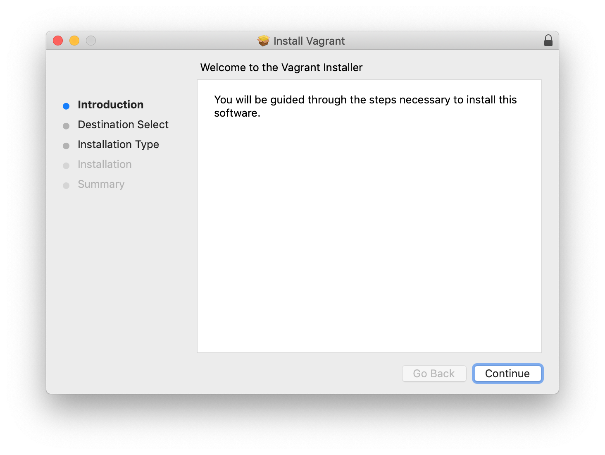
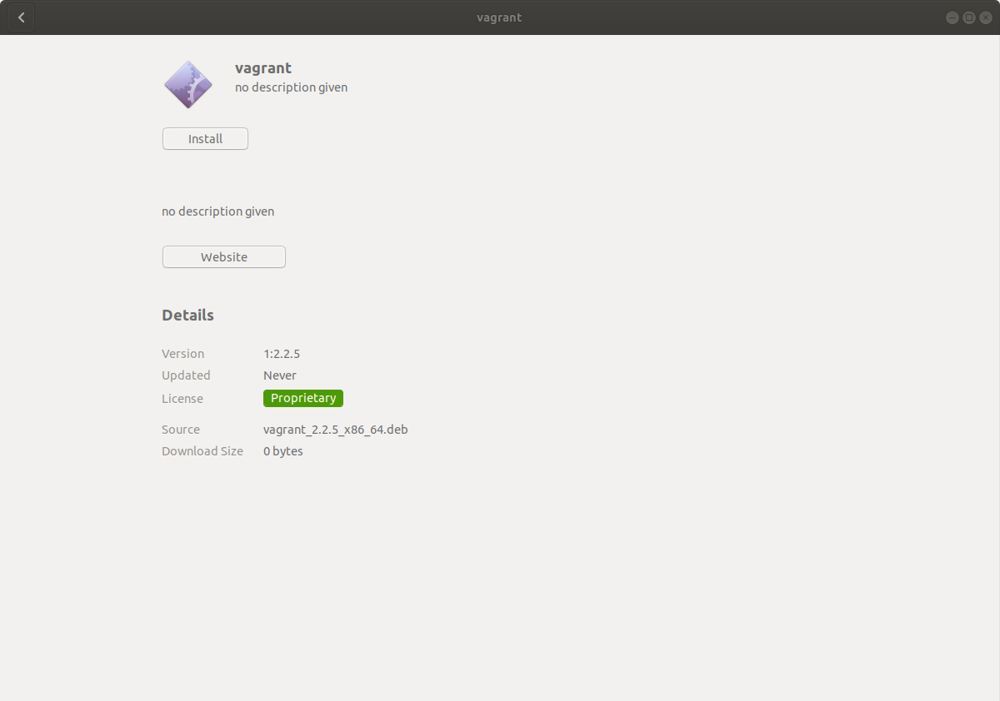
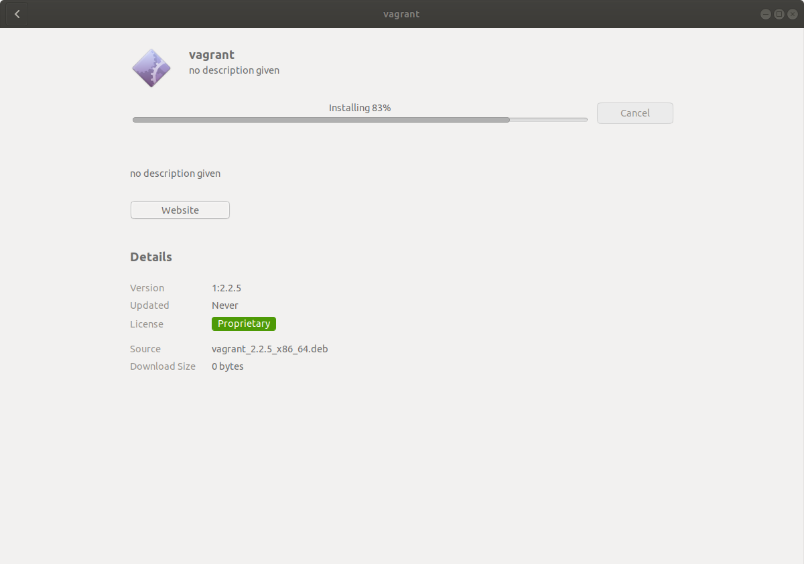

# Vagrant lab #

## Install Vagrant ##

Separate instructions follow for Mac OSX, Windows and Linux.

### Mac OSX ###

Double-click on the disk image file vagrant_2.2.5_x86_64.dmg

Double-click on vagrant.pkg and follow the installer.

Verifying the installation worked on Mac OS X

~~~~bash
$ vagrant --version
Vagrant 2.2.5
$
~~~~

### Windows ###

Double-click on the executable vagrant_2.2.5_x86_64.msi and follow the install wizard with default settings. Give it permission to install the device drivers.

### Linux ###

Copy the appropriate file for your operating system:

- vagrant_2.2.5_i686.deb for a 32-bit system
- vagrant_2.2.5_x86_64.deb for a 64-bit system

Install it by double-clicking,

or from the command line using this command:

~~~~bash
~$ sudo dpkg -i vagrant_2.2.5_x86_64.deb
~~~~

> **Note**:
  The installer will automatically add vagrant to your system path so that it is available in terminals. If it is not found, please try logging out and logging back in to your system (this is particularly necessary sometimes for Windows).

----
