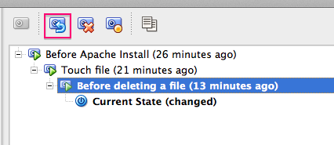

# VirtualBox lab: Snapshots

## Objective

You will use the Snapshots feature of VirtualBox to make modifications to your operating system in a safe fashion.

## Finding the Snapshot window

Let's start by taking a snapshot of our Virtual Machine we installed earlier. We do not need to stop the machine for this.

In the Oracle VM VirtualBox Manager, make sure your Virtual Machine is selected (click on it once).

You will notice in the top right of the window, two buttons:

- Details
- Snapshots

Click on the `Snapshots` button.

You will see the right side of the VirtualBox Manager window change.

In the window, you will see:

`-> Current State`

And nothing else. This means there are not yet any snapshots for this machine.

## Take a snapshot

To take a snapshot, simply click on the little icon that looks like a Camera, just above:

A windows pops up, where you can give the snapshot:

- A name
- A description

Call the Snapshot whatever you want: "Before OS upgrade" or "Testing snapshots". Same for description - here you can say exactly what you want to test, so you can later remember what you were trying to achieve :)

Click on 'OK'. Within a few seconds, the view should change, and you will see something similar:

You can see that a snapshot has been created, but your machine continues to run in what is known as the "Current State".

You are free to take as many snapshots as you want, after every change you make in your Virtual Machine. If you've ever played computer games, think of it as "Save Game", where you can go back to where you were if you lose.

## Make some changes

Now, try and make some changes to your Virtual Machine.

Suggestions:

- Create some files in your home directory:

    $ touch file-after-snapshot

Take another snapshot, call it "Before installing apache"

- Install the `apache` web server:

    $ sudo apt-get install apache2

Now take a new snapshot, call it "Before deleting a file"

- Remove a critical file (!) like /etc/passwd

    $ sudo rm /etc/passwd

Oops! That last change was a bit critical. Without the /etc/passwd file, our system is not going to function very well... We'll need to roll back to a previous snapshot...

## Rolling back changes

In the VirtualBox Manager, click on (highlight) on the snapshot named "Before deleting a file".

You will notice that some buttons (commands) above the list of snapshots are disabled.

Also notice the camera Icon with a red cross on it:

This is the "Delete Snapshot" button. It will remove the snapshot with this name. It doesn't change anything at all on your running machine, but it means you _CANNOT_ go back to this state if you delete the snapshot.

Why would you want to do this ?

Well, let's say you've just installed Apache, and you're happy with the installation. You could then delete the Snapshot you took just before installing Apache. Snapshots do use disk space on your Host, and if you have too many, it can slow down operations.

But what if we want to "Roll back" the system to this snapshot ? By rolling back, we mean "Please put my virtual machine in the state it was at the time this snapshot was taken".

There is a button for this, but it's currently disabled:

To make it possible to roll back to a given snapshot, you must first stop execution of your Virtual Machine. The simplest way to do this is to shut down your virtual machine.

You can do this from within the machine itself, by running:

    $ sudo halt -p

Or by choosing Machine -> Close -> ACPI Shutdown from the Machine pull down menu. Confirm, and the machine will shut down.

Once the machine is off, if you return to the Snapshot viewer, you will see that it is now possible to highlight a snapshot, then click on the button that was previously unavailable:

## Roll back!

Click on the roll back button (with the little blue arrow pointing backwards)

You will be asked to confirm your change:

You are being asked if you want to create a snapshot of your CURRENT state, BEFORE rolling back to the older snapshot.

Why ? Imagine you roll back by mistake... _ALL THE CHANGES YOU HAVE MADE AFTER THIS SNAPSHOT WILL BE LOST!_

But if you make a snapshot (the default choice) before rolling back, you have the opportunity of "Undoing" your rollback, and returning to your machine it its newest state.

So make sure "Create a snapshot of the current machine state" is checked, and click on `Restore`.

You will have to, once again, give a name to the snapshot. Call it "Most recent state" or something similar, then click on `OK`.

You should now see something similar:

Note that your machine is still shut down, so let's start it.

Once the machine is booted, open a Termainal (if running a Desktop), and make sure that the file you deleted (`/etc/passwd` or other) is there again.

Isn't that cool ?

**BIG WARNING: ROLLBACK OF SNAPSHOTS IS NOT EQUIVALENT TO RESTORING FILES FROM A BACKUP: IT IS THE SAME AS ERASING YOUR MACHINE AND COPYING THE FILES FROM A FULL BACKUP. ANYTHING AFTER THE BACKUP IS LOST IF YOU DON'T TAKE A SNAPSHOT!**