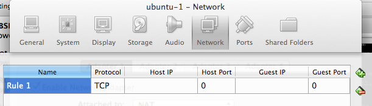
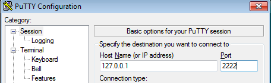

# VirtualBox lab: Port Forwarding

## Objective

You will use the Port Forwarding network feature of VirtualBox, and configure it to access your guest VM via SSH.

## Why Port Forwarding ?

By default your VM is created with a network connection in NAT mode.

We have discussed this earlier, but as a reminder:

- in NAT mode, the Guest can access the outside world, but does so while being NAT'ed behind the IP of the Host.
- the Host, and other machines outside, cannot access the Guest.

Everything is fine while you are using the console, as we have done so far, but what if you want to:

- access a service on the Guest, a web server for example ?
- log in to the Guest using SSH ?

## Using Port Forwarding

To enable port forwarding, open the settings for your virtual machine.

- You can do this from the VirtualBox Manager (right click on the VM name on the left side of the window, then choose `Settings...`), then choose Network

- Alternatively, click on the Network Settings icon in bottom toolbar of your running VM window

Verify that `NAT` is selected in the `Attached to:` selector.

At the bottom of the window, click on the `Port Forwarding` button.

You are then presented with a form where you can add new forwardings.

## Adding a forwarding

What we are going to do is pick a port on our Host, for example 2222, and forward TCP connections received on this port, to port 22/TCP (SSH) on our guest.

To do this, click on the green _(+)_ button on the right.

Once you click it, a new row appears, ready to be filled out:

Fill it out as follows:

Name | Protocol | Host IP | Host Port | Guest IP | Guest Port
-----|----------|---------|-----------|----------|-----------
SSH  | TCP |  | 2222 |  | 22

**Note**:

- `Host IP` is set to nothing - this is on purpose, and is equivalent to saying `0.0.0.0`. It means that ANY MACHINE that can access your Host on TCP port 2222 will be able to talk to the SSH on your guest. Be careful!

~~~Note
If you want to disable this, and only allow connections coming from your Host to talk to the Guest, then put `127.0.0.1` instead. via the forward.[↩](#fnref1)
~~~

- `Guest IP` is left blank - there is no need by default to change this.

What the above rule means is:

"If a TCP connection is received on the Host on TCP port 2222, send it on to the Guest on TCP port 22"

To apply the changes, click `OK`.

You are back in the Network Settings windows. Click `OK` again to exit the Network Settings.

You will probably need to restart the Virtual Machine so that the changes are applied:

- Shut down the VM (Close -> ACPI Shutdown)
- Quit VirtualBox
- Restart VirtualBox
- Start the VM

## Testing the forwarding

To verify that the change has been implemented:

- Open a terminal on your Host (a DOS Command Prompt if this is Windows), and type the following command:

    netstat -a | more

Use the space bar to move one page at a time, and look for a line similar to this:

~~~shell
    tcp4       0      0  0.0.0.0.2222         *.*                    LISTEN
~~~

or

~~~shell
    tcp4       0      0  *.2222         *.*                    LISTEN
~~~

This means that your Host is listening on port 2222 for connections.

## SSH to the Guest

Now, it's time to try and connect to the Guest.

To do so, use the Putty terminal emulator (if you are on Windows). For Linux and Mac users, use the built in terminal.

You need to remember the username you created on your Guest! Remember, you _CANNOT_ log in as root using SSH, so this will have to be the user you created.

If using Windows:

- Open Putty, and in the 'Host Name (or IP address)' field, enter: '127.0.0.1', and in the 'Port' field, enter '2222', then click `OK`

If everything goes well, you will be prompted to accept the host key. Click 'Yes'. We will discuss this in class.

You will then be prompted to `login as:`. Here you will enter the username you created previously.

If using Linux or OS X:

- Linux/Mac: `ssh -l _username_ -p 2222 127.0.0.1`

... remember to replace `_username_` with the user you created!

You will be prompted to accept the host key:

~~~ssh
    The authenticity of host '[127.0.0.1]:2222 ([127.0.0.1]:2222)' can't be established.
    RSA key fingerprint is ef:f3:e6:01:67:44:e4:3d:57:4a:64:80:f1:41:53:8c.
    Are you sure you want to continue connecting (yes/no)? yes
~~~

You will then be prompted to enter the password for the username:

~~~prompt
    [email protected]'s password:
~~~

Enter your password.

You should now be logged in!

## Optional

Ask other participants to log into your VM - you will provide them with two parameters:

- the IP of your own laptop
- the user to log in with
- the password

* * *

1. If you want to disable this, and only allow connections coming from your Host to talk to the Guest, then put `127.0.0.1` instead. via the forward.[↩](#fnref1)
