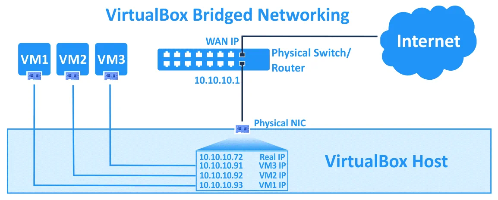
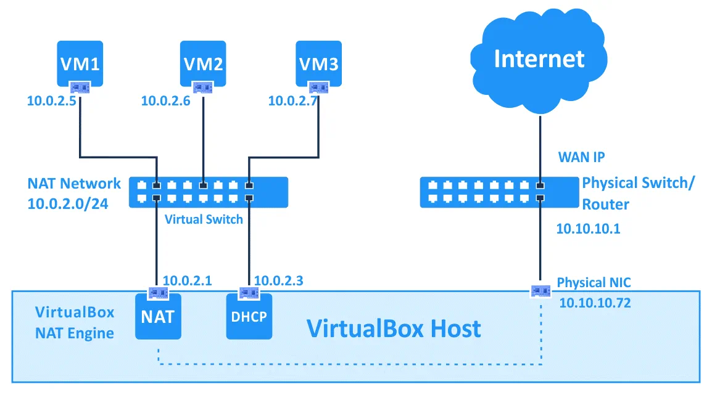

<style scoped>
h1 {
  color: #4e8fc7;
}
h2 {
    color: #455a64;
    color: #f97c28;
}
img {
    float: left;
    margin-left: -40px;
}
pre {
    margin: -25px 50px 0px;
    width: 810px;
    float: right;
}
pre > code {
    background-color: #f8f8f8;
    color: #4d4d4c;
}
</style>
<!--
_class: lead
_footer: '' 
_paginate: false
-->

# Virtualization Technique

&nbsp;
&nbsp;

## Network Modes

&nbsp;
&nbsp;

### NREN

Feb 10 - 12, 2023

[](http://creativecommons.org/licenses/by-nc/4.0/)

```licence
This material is licensed under a Creative Commons Attribution-NonCommercial 4.0 International License (http://creativecommons.org/licenses/by-nc/4.0/)
```

---

<style scoped>
blockquote {
    border-top: 0.1em dashed #555;
    font-size: 60%;
    margin-top: 100px;
}
blockquote:before {
    content:"";
}
blockquote:after {
    content:"";
}
</style>

## How do virtual hosts access the network ? <!--fit-->

- Virtual Machines are connected to virtual network adapters, presented to the guest OS by the Hypervisor.
- But what is the virtual network adapter connected to on the host side ?
  - Several possibilities, Essentially:
    - Bridged mode
    - Other modes (host-only, NAT, internal)

> **Note**: that the above terminology is usually associated with desktop virtualization software like VirtualBox and VMWare, although other products/solutions have reused the same terms

---

## Bridged mode

- This is the most straightforward way to attach a Virtual Machine to the network.
  - The VM is “bridged”, or attached, to the same network that the host OS is physically connected to, using the Host’s interface
  - If DHCP is present on this network, then the VM will receive an IP from it.
  - To other hosts on the network, the VM will look like just any other machine, with its own MAC address and IP address.

---

<style scoped>
img {
    max-width: 80%;
    /* width: 100%; */
    margin: -30px 60px;
}
blockquote {
    border-top: 0.1em dashed #555;
    font-size: 60%;
    margin-top: 60px;
}
blockquote:before, blockquote:after {
    content:"";
}
ol, ul {
    font-size: 70%;
}
</style>

## Bridged mode (contd)



- Multiple VMs can be attached to the network in this fashion.
- Pros: VM participates in the network like any other machine
- Cons: VMs are visible to other machines (whether one wants to or not), and there has to be enough IPs available on the network

> **Note**: that the host does not necessarily need to have an IP address on the network.

---

## NAT mode

- This is the default way for VirtualBox and VMware Desktop editions to connect the VM.
- NAT (Network Address Translation) is used to allow the Guest VM to access the outside networks.
- NAT uses the IP address configured on the Host’s physical interface, but the Host and Guest still cannot talk together.

---
<style scoped>
img {
    max-width: 90%;
    /* width: 100%; */
    margin: 0px 60px;
}
</style>

## NAAT mode (contd)



---
<style scoped>
ol, ul {
    font-size: 87%;
}
</style>
## Other modes: host-only, internal

- These modes do not place the VM directly on the network where the Host is connected to the outside world.
- Instead, a private, internal network is created, and the VM is placed on it.
  - host-only:
    - the Host and the Guest VM can communicate together, but the VM cannot talk to the outside world - only with the Host For example, it’s possible to SSH directly to the Guest from the Host (and vice-versa)
  - internal:
    - the Guest VM is isolated and cannot talk to the Host or the outside world, but can talk to other VMs, if they are connected to the same internal network

---
<style scoped>
img {
    max-width: 80%;
    /* width: 100%; */
    margin: -30px 60px;
}
blockquote {
    border-top: 0.1em dashed #555;
    font-size: 55%;
    margin-top: 40px;
}
blockquote:before {
    content:"*";
}
blockquote:after {
    content:"";
}
ol, ul {
    font-size: 85%;
}
</style>
## Accessing the Guest from the Host <!--fit-->

- So what do we do if we want to access the Guest from the Host ? - 3 Possibilities
  - Use bridged mode
    - the VM is then a machine just like any other on your local network, and you can SSH to it using the IP address configured (statically or using DHCP)
  - Use Host-only mode
    - you can then connect to the VM, and vice-versa, but the VM cannot talk to hosts “outside”
  - Use Port Forwarding
    - which maps TCP/UDP ports on the Host to TCP/UDP ports on the VM. We will see this last solution now. \*

> VMware has a mode combining Host-only and NAT, which solves this problem. With VirtualBox, one can give the VM two network interfaces: one host-only, one NAT, or one can use Port Forwarding

---

## Note

- A very good article explaining the different network modes in Virtual Box

[https://blogs.oracle.com/scoter/post/oracle-vm-virtualbox-networking-options-and-how-to-manage-them](https://blogs.oracle.com/scoter/post/oracle-vm-virtualbox-networking-options-and-how-to-manage-them)

---

<!-- _class: lead -->
## :question: <!--fit-->
