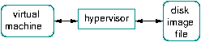
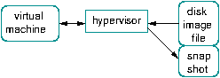
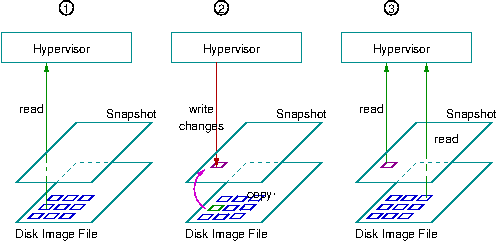

<style scoped>
h1 {
  color: #4e8fc7;
}
h2 {
    color: #455a64;
    color: #f97c28;
}
img {
    float: left;
    margin-left: -40px;
}
pre {
    margin: -25px 50px 0px;
    width: 810px;
    float: right;
}
pre > code {
    background-color: #f8f8f8;
    color: #4d4d4c;
}
</style>
<!--
_class: lead
_footer: '' 
_paginate: false
-->

# Virtualization Technique

&nbsp;
&nbsp;

## Snapshots

&nbsp;
&nbsp;

### NREN

Feb 10 - 12, 2023

[](http://creativecommons.org/licenses/by-nc/4.0/)

```licence
This material is licensed under a Creative Commons Attribution-NonCommercial 4.0 International License (http://creativecommons.org/licenses/by-nc/4.0/)
```

---

## Saving and restoring state with virtual machines <!--fit-->

- What are we trying to do ?
  - Make it possible to save the state of a Virtual Machine
- By saving the state, we mean saving the contents of the disk, memory and CPU
- Saving the state allows multiple things:
  - testing possibly destructive operations (installing software, upgrading the operating system, . . . ) without damaging / modifying the Virtual Machine
  - restoring the Virtual Machine to a previously known “good state” (possibly following one or more destructive operation)
- We call this “saving of the state” Snapshots

---

## Snapshots &nbsp;

- A feature of virtualization technology that allow you to capture the state of a virtual machine at a specific point in time
- used for - Backups, Testing, Version control, Cloning
- All hypervisor software suites offer Snapshotting as a feature (VirtualBox, VMWare, KVM/QEMU, XEN, Hyper-V, . . . )
- Snapshotting is one of the unique benefits of using virtualization in the first place.

---

## Backup

- snapshots can be used as a backup of a virtual machine's state
- making it possible to restore the virtual machine to a previous state if something goes wrong

---

## Testing

- snapshots can be used to test changes to a virtual machine, such as
  - installing new software
  - changing configuration settings
- If the changes result in a problem, the virtual machine can be rolled back to the previous snapshot

---

## Version control

- snapshots can be used to track changes to a virtual machine over time
- it makes easier to revert to a previous state if necessary

---

## Cloning

- snapshots can be used to clone a virtual machine
- we can create an entirely new disk image file without having to copy all of the image to a new file

&nbsp;

- Cloning is slightly different, because it will allow us to use the “source” machine and its disk images, while we run “clone” machines based on the “source” machine.

---

## How do snapshots work ?

- Snapshots work by capturing the state of a virtual machine and storing it as a separate image file.
- The image file contains information about
  - the virtual machine's memory
  - storage
  - configuration
  - any changes that have been made to the virtual machine since the snapshot was taken.

---

<style scoped>
blockquote {
    border-top: 0.1em dashed #555;
    font-size: 60%;
    margin-top: 100px;
}
blockquote:before {
    content:"*";
}
blockquote:after {
    content:"";
}
</style>

## How do snapshots work? (contd.) <!--fit-->

- When a snapshot is taken, the hypervisor ...
  - temporarily pauses operation of the Virtual Machine
  - creates a special disk image * (the snapshot file)
  - saves the state of the CPU, and the RAM
  - ensures that the original disk image for this virtual machine will not be modified by write operations
  - resumes operation of the Virtual Machine

> The snapshot file doesn’t necessarily appear as a separate file. It can be part of the disk image file used by the Virtual Machine, in a special section.

---

<style scoped>
img {
    max-width: 100%;
    width: 100%;
    margin: 0px 20px;
}
</style>

## Hypervisor and disk image files

- Remember the hypervisor controls the Virtual Machine’s resources, including disk access.
- Every time the Virtual Machine wants to write to the disk, the hypervisor intercepts this, looks up the block number being written, and maps this to the proper location in the Disk Image File.



---

<style scoped>
img {
    max-width: 100%;
    width: 100%;
    margin: -20px 20px;
}
</style>

## When using snapshots

- Once a snapshot has been created, the Hypervisor stops writing changes to the original disk image file. 
- Instead, it will write changes to the snapshot file.



- Note the direction of the arrows.

---

## Snapshots and copy-on-write

- The snapshot file only contains _changes_ (differences) to the disk image file: 
  - the disk image file itself is not modified.
- The Hypervisor still uses the disk image file to **READ**, but any changes go to the snapshot.
- This is called **Copy On Write**.

---

<style scoped>
img {
    max-width: 100%;
    width: 80%;
    margin: -30px 100px;
}
</style>

## Copy on Write

- Let’s see what happens when we read and write disk blocks to a disk image file. . .
- All the time, the VM (not shown) just thinks there is only one disk.



---

## Rolling back changes

- Let’s imagine that our change didn’t go very well:
  - failed upgrade
  - software install for testing
  - or simply because we made a mistake and deleted some files
- We have the possibility of rolling back to a previously known state (snapshot).
- This will lose the current state of the machine, and “travel back in time” to the previous state.

---

<!-- _class: lead -->
## :question: <!--fit-->
