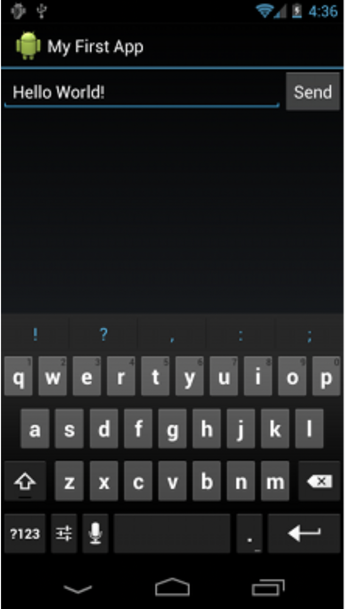
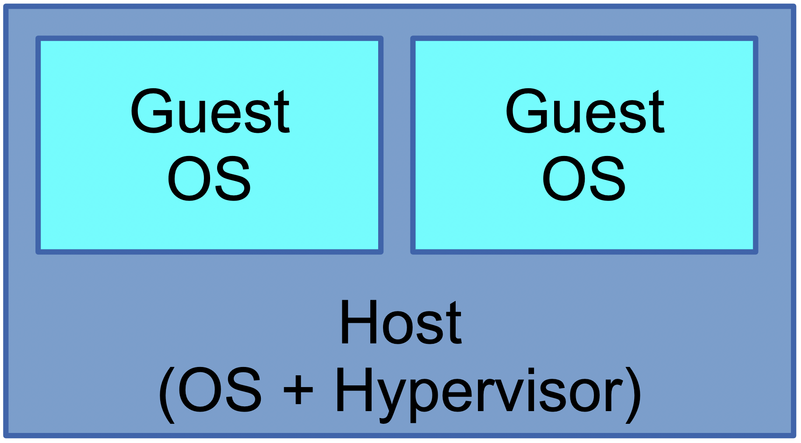

<style scoped>
h1 {
  color: #4e8fc7;
}
h2 {
    color: #455a64;
    color: #f97c28;
}
img {
    float: left;
    margin-left: -40px;
}
pre {
    margin: -25px 50px 0px;
    width: 810px;
    float: right;
}
pre > code {
    background-color: #f8f8f8;
    color: #4d4d4c;
}
</style>
<!--
_class: lead
_footer: '' 
_paginate: false
-->

<br />

# Introduction

to<br />

## Virtualization

<br />

### NREN

Feb 10 - 12, 2023

[](http://creativecommons.org/licenses/by-nc/4.0/)

```licence
This material is licensed under a Creative Commons Attribution-NonCommercial 4.0 International License (http://creativecommons.org/licenses/by-nc/4.0/)
```

---

## What is Virtualization?

- Virtualization is the creation of a virtual version of something, such as
  - a operating system
  - a server
  - storage devices
  - network resources

- It allows multiple systems to run on a single physical machine, increasing resource utilization and improving hardware independence.

---

## Terminology

- **Virtualization**:
  - dividing available resources into smaller independent units
- **Emulation**:
  - using software to simulate hardware which you do not have
- The two often come hand-in-hand
  –e.g. we can _virtualize_ a PC by using it to _emulate_ a collection of less-powerful PCs

---

## Virtualization: Benefits

- **Consolidation**
  - Most systems are under-utilized, especially the CPU is idle for much of the time
  - Do more work with less hardware
  - Reduced space and power requirements
- **Management**
  - Less hardware inventory to manage
  - Concentrate your resilience efforts
  - Increased isolation between services
  - Abstract away (hide) differences in hardware

---

## Virtualization: Benefits (contd.)

- **Flexibility**
  - Grow systems on demand (e.g. allocate more CPU or RAM where it is needed)
  - Create new services quickly without having to install new hardware every time
  - Dynamically create and destroy instances for testing and development
- **New capabilities**
  - Snapshot/restore, cloning, migration, ...
  - Run different OSes on the same machine at once

---

<style scoped>
img {
    max-width: 100%;
    #float: right;
    #margin-right: 0;
    #padding-right: 0;
}
</style>

## Virtualization: a familiar example <!--fit-->


- Who has not seen this before?!
- Like having two (or more) hard drives
  - you get to choose the sizes
- **_Why_** is this useful?

---

## Virtualization: Another example

- Virtualize a switch: VLANs
  - like dividing a switch into separate switches
- Benefits:
  - can keep traffic separate (broadcast domains)
  - can create VLANs and how they are assigned to ports, purely through software configuration
  - can combine VLANs onto a single cable and split them out again (tagging/trunking)

---

<style scoped>
img {
    max-width: 100%;
    #float: right;
    #margin-right: 0;
    #padding-right: 0;
}
</style>

## VLANs


---

## Emulation

- In software, you can simulate the behaviour of a device which doesn't exist
- Example: emulation of a CD-ROM drive using an ISO file
  - a request to read block N of the (virtual) CD-ROM drive instead reads block N of the ISO file
  - similar to partition mapping
- You can simulate any hardware - including the CPU or an entire system!

---

<style scoped>
img {
    max-width: 25%;
    #float: right;
    margin-top: -15px;
    margin-left: 50px;
    margin-right: 20px;
    padding-left: 50px;
    padding-right: 50px;
}
</style>

## Emulation: example

- Android SDK
  - Emulates an Android smartphone with ARM CPU
  - The "screen" is mapped to a window on your PC

 

---

## Emulation: more examples

- Dynamips / Dynagen / GNS3
  - Emulates a Cisco router with MIPS CPU and network interfaces

- QEMU
  - Emulates an entire PC (i386 processor and interfaces)

---

<style scoped>
img {
    max-width: 90%;
    margin-left: 40px;
    padding-right: 10px;
}
</style>

## What's in a PC?


---

## Boot up sequence

- A small program (the BIOS) runs when machine is switched on
- It uses the hardware to load an operating system–boot from hard drive, USB/CD-ROM, network...
- Modern operating systems then ignore the BIOS from that point onwards
- The next slide shows a machine after it has booted up (simplified)

---

<style scoped>
img {
    max-width: 90%;
    margin-left: 40px;
    padding-right: 10px;
}
</style>


---

## Points to note

- The device drivers in the OS interact with the hardware
- User processes are forbidden by the OS from interacting directly with the hardware
  - the OS configures protection mechanisms to enforce this

---

## What we need to emulate/virtualize a PC? <!--fit-->

- we must emulate all the components of the PC
  - hard disk interface, network card
  - graphics card, keyboard, mouse
  - clock, memory management unit etc
- We want multiple instances to co-exist and not be able to interfere with each other
  - access to memory must also be controlled
- The software to do this is called a _**hypervisor**_

---

<style scoped>
img {
    max-width: 100%;
    margin-left: 10px;
    padding-right: 10px;
}
</style>


---

## Virtual Machines

- Each emulated PC is a "**virtual machine**"
- Hypervisor allocates some real system RAM to each VM, and shares the CPU time
- Hypervisor emulates other hardware, e.g. disk and network interfaces
- Within each VM you can boot an operating system
- Full hardware virtualization means different VMs can be running different OSes

---

<style scoped>
img {
    max-width: 70%;
    margin-top: -20px;
    margin-left: 50px;
    padding-right: 10px;
}
</style>

## Virtualization terminology

- The _**host**_ is the machine running the emulation software
- The _**guest**_ is the emulated (virtual) machine
- One host could be running many guests



---

<style>
blockquote {
    border-top: 0.1em dashed #555;
    font-size: 60%;
    margin-top: auto;
}
blockquote:before {
    content:"*";
}
blockquote:after {
    content:"";
}
</style>

## The Hypervisor

- a software layer that sits between the operating system and physical hardware of a computer
- its purpose is to create virtual machines that can run multiple, isolated operating systems on a single physical machine.
- it manages and allocates the underlying physical resources to each virtual machine.
- serves as the intermediary between the virtual machines and the physical resources, ensuring that each virtual machine has access to the resources it needs to operate

---

## Types of Hypervisor

- Type 1 hypervisors
- Type 2 hypervisors

---

## Type 1 hypervisors

- known as bare-metal hypervisors
- run directly on the host's physical hardware
- provide a virtualized environment for guest operating systems
- examples: 
  - VMware ESXi
  - Microsoft Hyper-V
  - Proxmox Virtual Environment
  - XCP-ng
  - Xen

---

## Type 2 hypervisors

- known as hosted hypervisors
- run on a host operating system
- provide a virtual environment for guest operating systems
- examples:
  - Oracle VirtualBox
  - VMware Workstation
  - VMware Fusion
  - Parallels Desktop

---

## Emulated disk hardware

- A hard drive is a "block device"
  - OS makes requests like "read block number 42", "write block number 99"
- Real hard drives have a fixed size!
  - This is what the guest OS will expect to see
- So the hypervisor must redirect these accesses to something else

---

## Emulated disk hardware (contd.)

- Options include:
  - a disk image file on the host (simple)
  - a partition or logical volume on the host (faster)
  - a remote file or remote block device (via network)
- A disk image file is easy to backup and transfer from host to host
- There are different ways to make a disk image file. Suppose we want the guest to see a 10GB virtual hard drive?
  - raw
  - image file

---

## RAW File or Disk

- A "raw" file is a just a plain 10GB data file
  - Nth block of the virtual hard drive corresponds to the Nth block in the image file
  - if this is allocated up-front, you use 10GB of (hopefully) contiguous space on the host
  - Fast in operation, avoids fragmentation on the host
  - Wasteful of space
  - Slow to create
  - Slow to copy

---

## Image File

- Custom VM image format with header and data
  - can be Thin provisioned
    - doesn't allocate space until each block is written to
    - reading from unallocated space reads zeros
    - can leads to fragmentation
    - can lead to failures if filesystem becomes full
  - can be Thick provisioned
    - pre-allocate all the space
    - wasteful of space
    - slow to create
- Various formats, e.g. VDI (virtualbox), VMDK (VMware), QCOW2 (qemu/kvm)
- Also add features like snapshots

---

## Emulated network hardware

- Each guest NIC gets a fake MAC address
- Different ways to interconnect with host NIC
- NAT
  - outbound packets translated to share the host's IP address
- Bridging
  - packets sent/received untranslated over the host's physical NIC
  - Each VM gets its own IP address on the external network
  - More transparent
  - Does not always work on wireless NICs though

---

## Summary

- Virtualization can make better use of your hardware by emulating more machines than you really have
- The emulated environment is provided by a _**hypervisor**_
- The hypervisor (host) lets you start up virtual machines (guests) each with its own operating system and emulated devices
- Guest hardware emulated using resources on the host

---

<!-- _class: lead -->
## :question: <!--fit-->
